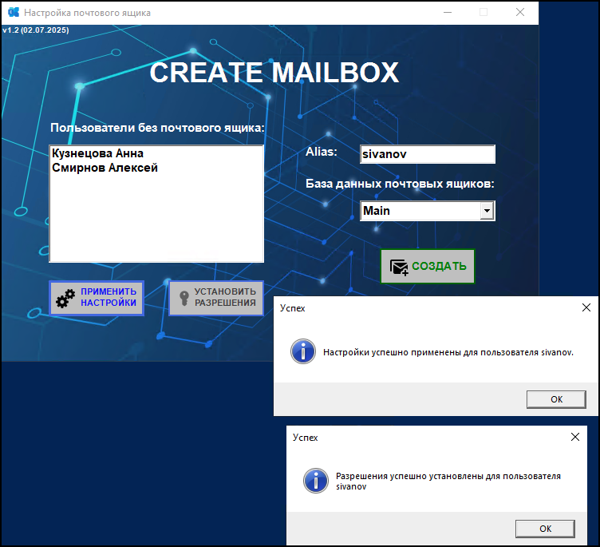
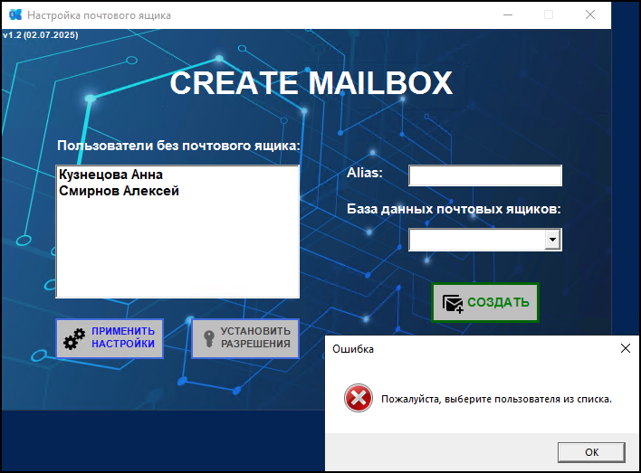

# Create-MailBox
Данный скрипт представляет собой полнофункциональное GUI-приложение на PowerShell, предназначенное для автоматизации создания и настройки почтовых ящиков пользователей в Microsoft Exchange.  
Основные возможности:  
 - Автоматическая проверка и получение прав администратора с перезапуском скрипта при необходимости.
 - Установка сессии подключения к серверу Exchange с использованием текущих учетных данных.
 - Получение списка пользователей из указанного организационного подразделения Active Directory, у которых отсутствуют почтовые ящики.
 - Выбор базы данных Exchange для размещения создаваемого почтового ящика.
 - Создание почтового ящика с заданным алиасом для выбранного пользователя.  
 
Дополнительные функции:
 - Применение региональных настроек почтового ящика, включая язык интерфейса, часовой пояс и локализацию стандартных папок.
 - Управление правами доступа, например, предоставление прав редактора пользователю sp_sync на папку «Календарь» почтового ящика.
 
## Скриншоты

### Главное окно:  

### Создание почтового ящика
Для создания почтового ящика необходимо выбрать пользователя из списка, в котором отображаются только те, у кого почтовый ящик отсутствует (определяется автоматически), указать базу для размещения почтового ящика и нажать кнопку "СОЗДАТЬ". 
После успешного завершения процесса отобразится соответствующее уведомление, а почтовый ящик будет создан в системе Exchange.

### Применение дополнительных функций 
Для применения региональных настроек почтового ящика необходимо нажать кнопку "ПРИМЕНИТЬ НАСТРОЙКИ". После успешного применения станет доступна кнопка "УСТАНОВКА РАЗРЕШЕНИЯ", при нажатии на которую будут установлены права доступа для пользователя.

### Обработка ошибок 
Если нажать кнопку "Создать", не выбрав пользователя, отобразится соответствующее уведомление.

